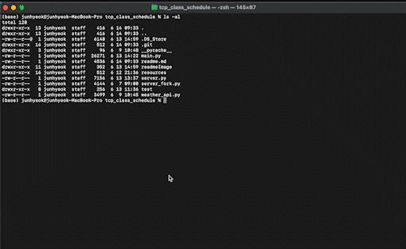
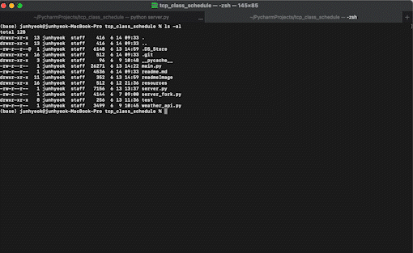
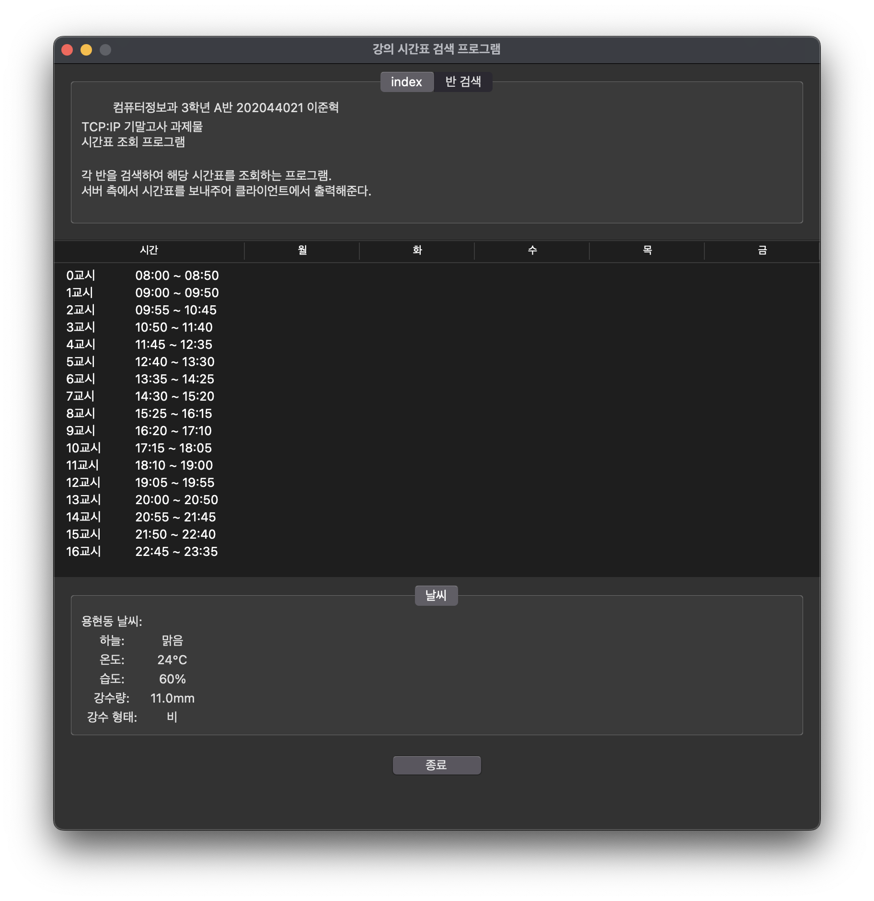
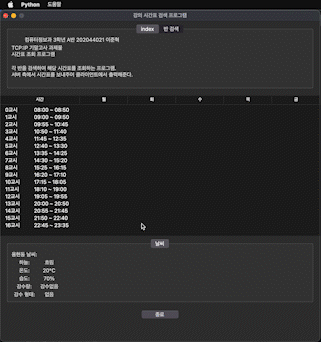
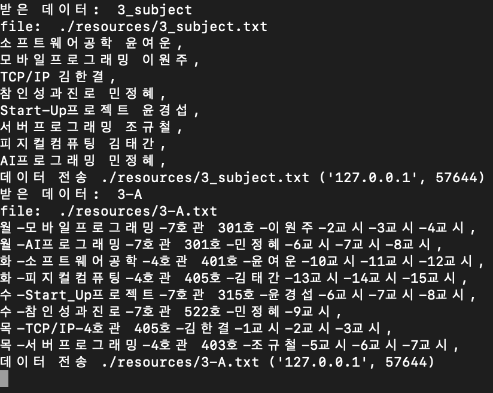
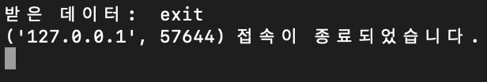

# **TCP통신의 시간표, 날씨 정보 프로그램**

TCP/IP 프로젝트  
컴퓨터정보과 3학년 A반 202044021 이준혁  

> Python 기반의 multi-thread 활용 프로그램  
> ___**thread Mutex**___ 사용

[Server](https://github.com/wnsgur9137/tcp_class_schedule/blob/master/server.py)와 [Client](https://github.com/wnsgur9137/tcp_class_schedule/blob/master/main.py)로 이루어진 다중 접속 프로그램

IP : localhost(127.0.0.1)  
PORT : 9008  

 
 

# **목차**

## [1. 개발 환경](#개발-환경)  
## [2. 진행 여부](#진행-여부)  
## [3. 코드 내용](#코드-내용)  
## [4. 실행 화면](#실행-화면)
## [5. 추후 개선 사항](#추후-개선-사항)

 
 

# **개발 환경**

Back-End
> Python 3.9.7

Front-End
> Python 3.9.7 (tkinter)

 
 

# **진행여부**

**서버**
- [x] 서버 생성 (fork 사용)
- [x] 서버 수정 (thread 사용)
- [x] 각 학년의 시간표 txt 파일로 생성
- [x] 날씨 api 생성
- [x] 클라이언트와 통신
- [x] 뮤텍스 사용(날씨 정보 수정 시 사용)

 

**클라이언트**
- [x] 클라이언트 생성
- [x] 메인 탭 생성
- [x] 시간표 선택 탭 생성
- [x] 시간표 출력(treeview)
- [x] 날씨 출력
- [x] 도움말 메뉴 생성
- [x] 각 반의 시간표 정보 출력
- [ ] 과목의 시간표 정보 출력 -> 현재 주석 처리
- [ ] 교수님의 시간표 정보 출력 -> 현재 주석 처리

 
 

# **코드 내용**

### [**server.py**](https://github.com/wnsgur9137/tcp_class_schedule/blob/master/server.py)  
 
- def read_send()
  - txt 파일을 읽고 클라이언트에 txt 파일 내용 전송
- def send_weather()
  - 날씨 api에서 현재 날씨를 받아와 클라이언트에 전송
- def weather_update()
  - 날씨를 정해진 시간마다 업데이트
- def schedule_thread()
  - 스레드로 구현 
  - 매 시간 45분마다 weather_update() 실행
- def threaded()
  - 각 클라이언트와의 전송/수신 스레드 함수
- \_\_main__
  - socket 정의 및 각 스레드 실행 메인 함수
  - IPv4, TCP 선언

### [**main.py**](https://github.com/wnsgur9137/tcp_class_schedule/blob/master/main.py)  
 
- def help_window()
  - 도움말 윈도우를 만드는 함수
  - 프로그램을 어떻게 사용하는지 안내해주는 메뉴 바
- def combo_print()
  - 학년을 선택함에 따라 과목, 교수님 목록을 변경하기 위한 함수
  - 4학년을 선택 시, A반은 J반으로 변경되고, B반과 C반은 비활성화 된다.
- def subject_data_dic()
  - 서버 측에서 수신받은 정보(문자열)를 변환(딕셔너리)해주는 함수
  - 문자열 -> 리스트 -> 딕셔너리 변환
- def class_start()
  - 학년과 반을 선택하여 조회 버튼을 클릭 시 실행되는 함수
  - 해당 학년과 반의 시간표(데이터)를 서버에서 받아온다.
- def sub_start() ***미구현*** 
  - 해당 과목의 시간표
- def pro_start() ***미구현***
  - 해당 교수님의 시간표
- def schedule_make_list()
  - 서버에서 받아온 문자열 형태의 시간표를 treeview 출력을 위한 형태(리스트, 튜플)의 형태로 변환한다.
- def showMessageBox()
  - 에러 메세지를 출력해주는 함수
- def exitTkinter()
  - 프로그램 종료 버튼을 누를 시 실행되는 함수
- \_\_main__
  - IPv4, TCP 통신 (client socket 정의) 선언
  - IP, PORT 선언
  - GUI 토대 선언
  - 전역 변수 선언
  - treeview(시간표) 초기 출력

 
 

# **실행 화면**

서버 실행

[//]: # (![server_start]&#40;./readmeImage/server_start.gif&#41;)
[//]: # (![server_start]&#40;./readmeImage/server_start.png&#41;)

 

클라이언트 실행  

[//]: # (![client_start]&#40;./readmeImage/client_start.gif&#41;)

[//]: # ()
[//]: # (![client_start]&#40;./readmeImage/client_start.png&#41;)

 

도움말 메뉴바  

[//]: # (![help]&#40;./readmeImage/help.gif&#41;)
[//]: # (![help_menubar]&#40;./readmeImage/help_menubar.png&#41;)
[//]: # (![help]&#40;./readmeImage/help.png&#41;)

 

시간표 통신 클라이언트  

[//]: # (![3-A_client]&#40;./readmeImage/3-A.gif&#41;  )

시간표 통신 서버  

[//]: # ()

 

클라이언트 종료 시 서버 출력  

[//]: # ()

 
 

# **추후 개선 사항**

1. 과목 선택 후 해당 과목의 시간표 출력 -> 현재 주석 처리
2. 교수님 선택 후 해당 교수님의 시간표 출력 -> 현재 주석 처리
3. 도움말 디자인 및 정보 개선
